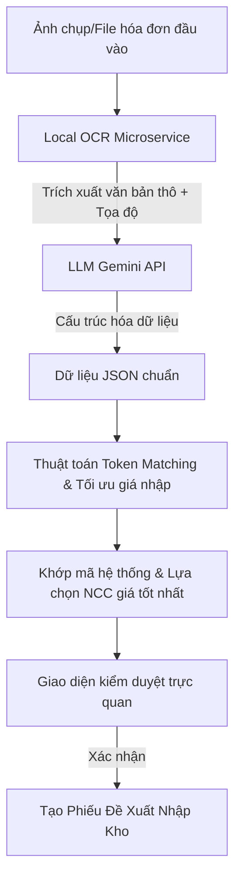

# BÁO CÁO CHI TIẾT & KỊCH BẢN THUYẾT TRÌNH BẢO VỆ KHÓA LUẬN
## ĐỀ TÀI: TÍCH HỢP AI OCR VÀ THUẬT TOÁN TỐI ƯU HÓA KHỚP DỮ LIỆU TRONG QUẢN LÝ MUA HÀNG (PROCUREMENT)

---

## PHẦN I: MÔ TẢ CHI TIẾT CHỨC NĂNG QUÉT AI OCR HÓA ĐƠN

Chức năng **AI Tự động Phân tích Hóa đơn (AI Invoice OCR)** được xây dựng nhằm giải quyết bài toán tự động hóa quy trình nhập liệu thủ công trong quản lý vật tư xây dựng. 

### 1. Quy trình hoạt động của hệ thống (Pipeline)

1. **Đầu vào (Input):** Người dùng tải lên ảnh chụp hóa đơn (chụp từ điện thoại hoặc bản scan giấy) tại màn hình Quản lý mua hàng.
2. **Nhận dạng chữ viết (OCR cục bộ):** Ảnh được gửi tới **OCR Microservice** (chạy bằng Python Flask với thư viện **PaddleOCR/EasyOCR**). Microservice xử lý ảnh và bóc tách các vùng văn bản thô (Raw text blocks) kèm theo tọa độ.
3. **Phân tích ngữ nghĩa bằng Trí tuệ nhân tạo (LLM Parser):** Dữ liệu văn bản thô được gửi qua **Gemini API** kèm theo System Prompt định hình nghiệp vụ. Gemini sẽ phân tích ngữ nghĩa, tự động nhận diện và bóc tách các trường thông tin quan trọng như:
   - Tên nhà cung cấp (mặc định trên hóa đơn)
   - Danh sách vật tư (Tên vật tư, Số lượng, Đơn giá từ hóa đơn)
   - Số hóa đơn, Ngày hóa đơn và Tổng tiền thanh toán.
   - Kết quả trả về là một cấu trúc JSON chuẩn hóa.
4. **Xử lý logic thông minh tại Client (Token Matching & Best Price Sourcing):**
   - **Chuẩn hóa chuỗi (Text Normalization):** Loại bỏ dấu tiếng Việt, ký tự đặc biệt, chuyển về chữ thường để tránh sai lệch font chữ.
   - **Thuật toán Khớp từ khóa (Token Matching):** Đối chiếu tên vật tư quét được với danh mục sản phẩm hiện có trong cơ sở dữ liệu hệ thống (SQL Server) để tự động map mã sản phẩm (`maSP`).
   - **Tối ưu hóa giá nhập (Best Supplier Selection):** 
     - *Trường hợp 1:* Nếu OCR nhận diện được Nhà cung cấp từ hóa đơn và hệ thống có khớp mã NCC đó, hệ thống sẽ tự động lấy giá cung cấp tương ứng của NCC đó cho các sản phẩm.
     - *Trường hợp 2:* Nếu hóa đơn không chỉ định rõ Nhà cung cấp, thuật toán sẽ tự động truy vấn lịch sử giá cung cấp từ cơ sở dữ liệu và **chốt nhà cung cấp có mức giá nhập thấp nhất** cho từng sản phẩm cụ thể.
5. **Giao diện Kiểm duyệt (Verification UI):** Hệ thống hiển thị bảng so sánh trực quan giữa thông tin OCR bóc tách được và thông tin hệ thống tự động khớp. Thủ kho có thể chỉnh sửa số lượng trực tiếp (tổng tiền tự động cập nhật theo thời gian thực) trước khi nhấn **"Tạo Phiếu Đề Xuất"**.

---

## PHẦN II: KỊCH BẢN THUYẾT TRÌNH TRƯỚC HỘI ĐỒNG (SLIDE SCRIPT)

*(Dưới đây là bài nói mẫu được biên soạn ngắn gọn, chuyên nghiệp, tập trung vào yếu tố kỹ thuật và giá trị thực tiễn để thuyết phục Hội đồng chấm khóa luận)*

### Slide 1: Đặt vấn đề & Lý do chọn đề tài
> **Kính thưa Thầy/Cô trong Hội đồng và toàn thể các bạn sinh viên.**
> 
> Trong quản lý chuỗi cung ứng vật liệu xây dựng, khâu **Nhập kho và Quản lý mua hàng (Procurement)** luôn đối mặt với thách thức lớn về thời gian và độ chính xác. Nhân viên kho thường xuyên phải nhập tay hàng chục hóa đơn giấy mỗi ngày với hàng trăm mặt hàng khác nhau. Việc này không chỉ gây **mất thời gian**, dễ xảy ra **sai sót nhập liệu** mà còn khiến doanh nghiệp **bỏ lỡ cơ hội mua hàng với giá tốt nhất** từ các nhà cung cấp khác nhau do không kịp đối chiếu giá.
> 
> Chính vì vậy, em đã nghiên cứu và phát triển chức năng **"Tự động phân tích hóa đơn bằng công nghệ AI OCR kết hợp Thuật toán tối ưu hóa giá nhập"** để giải quyết triệt để vấn đề này.

### Slide 2: Kiến trúc hệ thống & Luồng dữ liệu (Data Pipeline)
> **Về mặt kiến trúc hệ thống, em đề xuất mô hình tích hợp 3 lớp:**
> 1. **Frontend:** Phát triển bằng React / React Native kết nối người dùng.
> 2. **Backend API:** Viết trên nền tảng .NET Core (hoặc Spring Boot) kết nối cơ sở dữ liệu SQL Server.
> 3. **AI Service:** Một Microservice chạy độc lập bằng Python Flask đóng vai trò xử lý OCR cục bộ trước khi chuyển tiếp thông tin ngữ nghĩa qua API của Mô hình ngôn ngữ lớn (Gemini).
> 
> Luồng xử lý như sau: Ảnh chụp hóa đơn tải lên sẽ qua mô hình OCR cục bộ để trích xuất văn bản thô. Văn bản này sau đó được mô hình ngôn ngữ lớn phân tích ngữ nghĩa để đưa ra cấu trúc JSON bao gồm: nhà cung cấp, ngày hóa đơn và chi tiết danh sách vật tư.

### Slide 3: Thuật toán đối sánh dữ liệu & Tối ưu hóa Procurement
> **Điểm đặc biệt và mang tính ứng dụng thực tiễn cao của hệ thống nằm ở khâu xử lý dữ liệu sau OCR:**
> 
> Thứ nhất, em sử dụng thuật toán **Token Matching (Khớp mã dựa trên token hóa văn bản)**. Tên vật tư trên hóa đơn giấy thường viết tắt hoặc khác biệt so với cơ sở dữ liệu (ví dụ: *"Xi măng Hà Tiên"* và *"Xi măng Hà Tiên PCB40"*). Thuật toán của em tiến hành bóc tách chuỗi thành các token độc lập, loại bỏ dấu tiếng Việt, tính toán trọng số tương đồng để khớp chính xác mã vật tư hệ thống mà không cần thủ công.
> 
> Thứ hai, em tích hợp logic **Săn giá tốt nhất (Best Price Sourcing)**. Khi phát hiện danh sách vật tư cần nhập, hệ thống sẽ tự động quét chéo bảng giá của tất cả đối tác cung ứng trong database để đề xuất nhà cung cấp có giá nhập thấp nhất cho từng mặt hàng. Điều này giúp doanh nghiệp tiết kiệm từ 5% đến 15% chi phí mua hàng trên mỗi lô vật tư.

### Slide 4: Kết quả demo và tính thực tiễn
> **Kính thưa Hội đồng, đây là kết quả thực tế trên giao diện hệ thống:**
> Khi nhân viên đưa ảnh hóa đơn lên, chỉ mất chưa đầy 3 giây, toàn bộ danh sách sản phẩm đã được nhận diện, khớp mã vật tư chính xác, đơn giá tự động điền từ NCC tối ưu nhất và tổng tiền được tính toán lại theo thời gian thực khi nhân viên thay đổi số lượng. Nhân viên chỉ cần nhấn "Tạo phiếu đề xuất" để hoàn tất quy trình thay vì mất 15-20 phút nhập tay như trước.

---

## PHẦN III: TẠI SAO LẠI CHỌN MÔ HÌNH AI & THUẬT TOÁN NÀY?

### 1. Tại sao dùng kết hợp OCR cục bộ (PaddleOCR/EasyOCR) và LLM (Gemini)?
*   **Hạn chế của OCR truyền thống:** Các thư viện OCR thuần túy (như Tesseract) chỉ đọc ra các dòng chữ rời rạc, không hiểu được đâu là "tên sản phẩm", đâu là "đơn giá", và cấu trúc bảng rất dễ bị méo mó khi ảnh bị nghiêng.
*   **Sức mạnh của LLM (Large Language Model - Gemini):** Gemini đóng vai trò như một bộ não phân tích ngữ nghĩa. Dù chữ viết thô từ OCR trả về bị lộn xộn, Gemini vẫn hiểu được ngữ cảnh để tách đúng cấu trúc hóa đơn dạng JSON nhờ vào khả năng suy luận ngôn ngữ vượt trội.
*   **Tối ưu chi phí & tốc độ (Hybrid Approach):** Việc chạy OCR nhận diện chữ ở local giúp giảm lượng dữ liệu gửi lên Cloud (chỉ gửi text thô thay vì gửi cả file ảnh dung lượng lớn), từ đó tiết kiệm băng thông, tăng tốc độ phản hồi và bảo mật dữ liệu tốt hơn.

### 2. Tại sao chọn thuật toán Token Matching & Best Price Sourcing?
*   **Khắc phục sai lệch chuỗi:** Trong thực tế xây dựng, hóa đơn ghi *"Thép Hòa Phát phi 10"* nhưng hệ thống lưu *"Thép cuộn phi 10 Hòa Phát"*. Thuật toán Token Matching giúp chia nhỏ chuỗi và so khớp tập hợp từ để tìm ra sản phẩm có tỷ lệ trùng khớp cao nhất, vượt trội hơn các hàm so sánh chuỗi thông thường (như so sánh chính xác hoặc chứa chuỗi).
*   **Giải quyết bài toán kinh tế:** Chức năng tự động tìm nhà cung cấp có đơn giá nhập thấp nhất giúp tự động hóa khâu khảo giá - một khâu tốn nhiều thời gian thương lượng và đối chiếu thủ công nhất trong doanh nghiệp xây dựng.

---

## PHẦN IV: BẢNG SO SÁNH VỚI CÁC GIẢI PHÁP KHÁC

Để bảo vệ luận điểm trước hội đồng, dưới đây là bảng so sánh chi tiết giữa giải pháp của đề tài với các hướng tiếp cận khác:

| Tiêu chí | Giải pháp của Đề tài (EasyOCR/PaddleOCR + Gemini LLM) | OCR truyền thống (Tesseract / Regex) | Cloud OCR trọn gói (Google Document AI / AWS Textract) |
| :--- | :--- | :--- | :--- |
| **Độ chính xác bóc tách cấu trúc** | **Rất cao (90-95%)**: Nhờ khả năng phân tích ngữ nghĩa mạnh mẽ của LLM. | **Thấp (50-60%)**: Dễ lỗi nếu bố cục hóa đơn thay đổi hoặc ảnh bị nghiêng. | **Rất cao (93-97%)**: Do được tối ưu riêng cho hóa đơn. |
| **Tính linh hoạt (Bố cục hóa đơn)** | **Cực kỳ linh hoạt**: Đọc được mọi mẫu hóa đơn từ các nhà cung cấp khác nhau mà không cần cấu hình trước template. | **Kém**: Phải viết Regex hoặc tọa độ cứng cho từng mẫu hóa đơn riêng. | **Khá tốt**: Nhưng bị giới hạn theo định dạng hóa đơn được hỗ trợ. |
| **Chi phí vận hành** | **Rất rẻ / Miễn phí**: OCR chạy cục bộ tại server, API LLM xử lý dạng text thô tốn cực ít token (Free-tier / Giá cực rẻ). | **Hoàn toàn miễn phí**: Chạy offline 100%. | **Rất đắt**: Tính phí trên mỗi trang ảnh gửi lên cloud (khoảng $0.05 - $0.15/trang). |
| **Mức độ phức tạp lập trình** | **Trung bình**: Sử dụng Prompt Engineering để định hình đầu ra JSON. | **Rất phức tạp**: Phải viết luật lọc Text (heuristics) và biểu thức chính quy (Regex) khổng lồ. | **Thấp**: Chỉ cần gọi SDK của nhà cung cấp Cloud. |
| **Khả năng Offline / Bảo mật dữ liệu** | **Tốt**: Bước OCR xử lý ảnh nhạy cảm được thực hiện local hoàn toàn, chỉ gửi text thô đã lọc lên LLM. | **Tuyệt đối**: Chạy 100% offline không cần internet. | **Kém**: Bắt buộc phải gửi toàn bộ hình ảnh hóa đơn nhạy cảm lên máy chủ bên thứ ba. |
